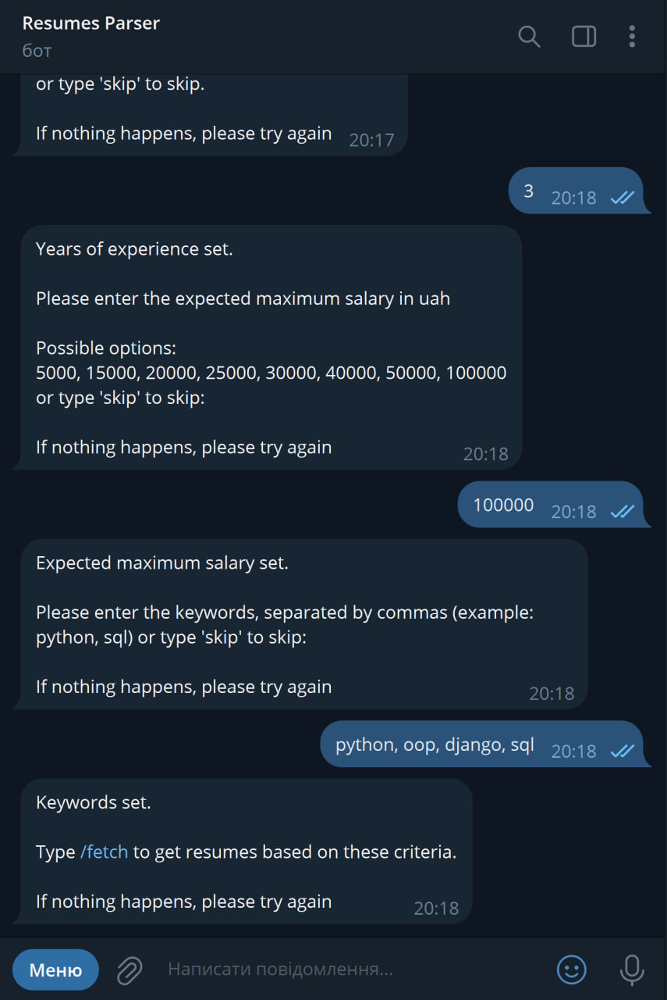

# Resumes Parser Bot

Resumes Parser Bot is a Telegram bot designed to parse resumes from work.ua and robota.ua, allowing users to filter and view relevant resumes based on specified criteria such as job position, location, and keywords.

## Features

- **Multiple Job Sites**: Choose between two job sites, work.ua and robota.ua.
- **Filtering Options**: Specify job position, location, expected maximum salary, experience level, and keywords to refine resume searches.
- **Display Top Resumes**: Fetch and display the 5 most relevant resumes matching the specified criteria.

## Installation

1. **Clone Repository**:

    ```bash
    git clone https://github.com/paashkovaaa/resumes_parsing_project.git
    cd resumes_parsing_project
    ```

2. **Set Up Virtual Environment**:

    ```bash
    python -m venv venv
    source venv/bin/activate  # On Windows: venv\Scripts\activate
    ```

3. **Install Dependencies**:

    ```bash
    pip install -r requirements.txt
    ```

4. **Telegram Bot Setup**:
   
   - Create a Telegram bot and obtain the API token from [Telegram Bot Father](https://core.telegram.org/bots#3-how-do-i-create-a-bot).

5. **Configure Environment Variables**:

    - Create a `.env` file based on `.env.sample` and add your Telegram bot token:

      ```env
      TELEGRAM_BOT_TOKEN=your-telegram-bot-token
      ```

## Usage

1. **Run the Bot**:

    ```bash
    python main.py
    ```

2. **Interact with the Bot on Telegram**:
   
   - Start a conversation with your bot.
   - Follow prompts to select the job site, set job details (position, location, etc.).
   - View and interact with resumes fetched based on your specified criteria.

## Code Overview

The bot is implemented using the `python-telegram-bot` library and structured as follows:

- **`main.py`**: Entry point of the application.
- **`data/`**: Contains data models and structures.
  - `resume.py`: Defines the structure of a resume.
- **`parsers/`**: Parsers for different job sites.
  - `robota_ua_parser.py`: Fetches resumes from robota.ua.
  - `work_ua_parser.py`: Fetches resumes from work.ua.
- **`telegram_bot/`**: Bot logic and handlers.
  - `telegram_bot.py`: Manages conversation flow and user interactions.
- **`utils/`**: Utility functions.
  - `filters.py`: Functions for filtering and processing data.

## How the Bot Works

1. **Starting the Bot**: Initiate the bot on Telegram.
   
2. **Choosing Job Site**: Select either work.ua or robota.ua for resume parsing.

3. **Setting Criteria**: Specify job position, location, salary expectations, experience level, and keywords.

4. **Fetching Results**: The bot retrieves and displays the most relevant resumes based on the provided criteria.





This bot streamlines the process of searching for resumes on popular Ukrainian job sites, offering flexibility and efficiency in recruiting efforts.
